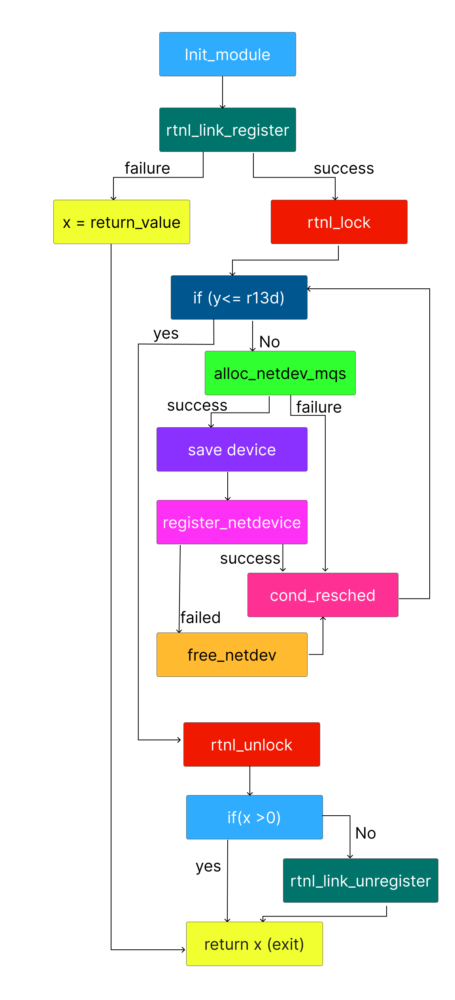

# Function: dummy_init()

## Overview

**Purpose**

> Creates and registers the dummy network device during module initialization.

---

## Function Summary

| Item | Value |
|------|------|
| Function | dummy_init |
| Return Type | int |
| Parameters | void |
| Called From | N/A |
| Calls | rtnl_link_register(), rtnl_lock(), alloc_netdev_mqs(), register_netdevice(), free_netdev(), cond_resched(), rtnl_unlock(), rtnl_link_unregister() |

---

## High-Level Behavior

1. Register rtnl_link_ops with rtnetlink
2. Take rtnl_lock
3. allocate network device
4. register an allocated network device
5. if something failed, free the network device
5. voluntary rescheduling point
6. unlock the rtnl_lock
7. if something failed unregister the rtnetlink

---

## Detailed Analysis

### 1. Register rtnl_link_ops with rtnetlink

**Observation**

- Prepares and invokes the `rtnl_link_register` kernel function.

**Evidence**

```assembly
0x08000366      48c7c70000..   mov rdi, 0                  ; pointer to struct rtnl_link_ops
0x08000375      e800000000     call 0x800037a              ; call rtnl_link_register
```

**Meaning**

- Registers a new network interface type with the RTNETLINK subsystem. 

---

### 2. Set rtnl_lock

**Observation**

- Invokes the `rtnl_lock` kernel lock.

**Evidence**

```assembly
0x08000384      e800000000     call 0x8000389              ; call rtnl_lock
```

**Meaning**

- This lock is important when registering a network device later. Therefore, it is necessary to prepare this lock in advance.

---

### 3. Allocate network device

**Observation**

- Prepare 6 arguments and invoked `alloc_netdev_mqs` kernel function.

**Evidence**

```assembly
0x08000399      41b901000000   mov r9d, 1                  ; rxqs(6th arg) = 1
0x0800039f      41b801000000   mov r8d, 1                  ; txqs(5th arg) = 1
0x080003a5      31ff           xor edi, edi                ; sizeof_priv(1st arg) = 0
0x080003a7      48c7c10000..   mov rcx, 0                  ; setup callback(4th arg) = &dummy_setup
0x080003ae      ba01000000     mov edx, 1                  ; name_assign_type(3rd arg) = 1
0x080003b3      48c7c60000..   mov rsi, 0                  ; format string(2nd arg) = dummy%d
0x080003ba      bbf4ffffff     mov ebx, 0xfffffff4         ; 4294967284
0x080003bf      e800000000     call 0x80003c4              ; call alloc_netdev_mqs
```

**Meaning**

- Allocate a network device called `dummy`(dummy+number).

---

### 4. Register an allocated network device

**Observation**

- After it has a valid device, it invokes the `register_netdevice` kernel function.

**Evidence**

```assembly
0x080003d7      4889c7         mov rdi, rax                ; rdi hold alloc_netdev_mqs returned device
0x080003da      e800000000     call 0x80003df              ; call register_netdevice
```

**Meaning**

- It calls for registering the generated valid device.

---

### 5. Network device registration failure

**Observation**

- If this failed to register network device it invoked the `free_netdev` kernel function.

**Evidence**

```assembly
0x080003e5      4c89e7         mov rdi, r12                ; device
0x080003e8      e800000000     call 0x80003ed              ; call free_netdev
```

**Meaning**

- Suppose it fails to register the network device. It frees the network device.

---

### 6. Voluntary rescheduling point

**Observation**

- Invoke the `cond_resched` kernel function.

**Evidence**

```assembly
0x080003f1      e800000000     call 0x80003f6              ; __SCT__cond_resched
```

**Meaning**

- This is inside the loop, providing a voluntary rescheduling point during repeated device creation. If rescheduling is needed, the current task allows the scheduler to run other tasks before continuing.

---

### 7. Unlock the rtnl_lock

**Observation**

- After the loop it invoke the `rtnl_unlock` kernel function.

**Evidence**

```assembly
0x080003fb      e800000000     call 0x8000400              ; rtnl_unlock
```

**Meaning**

- After device allocation and registration are complete, it releases rtnl_lock.

---

### 8. Unregister the rtnetlink

**Observation**

- Prepare and invoke the `rtnl_link_unregister` kernel function.

**Evidence**

```assembly
0x08000404      48c7c70000..   mov rdi, 0                  ; pointer to struct rtnl_link_ops
0x0800040b      e800000000     call 0x8000410              ; rtnl_link_unregister
```

**Meaning**

- If initialization fails, it unregisters the previously registered rtnl_link_ops

---

## Important Structures

| Structure | Fields Used |
|-----------|------------|
| struct rtnl_link_ops | not visible in static analysis |
| struct net_device | not visible in static analysis |

---

## Called Functions

| Function | type |Purpose |
|----------|------|---------|
| dummy_setup | indirect callback | as a setup callback in network device allocation. |

---

## Key Observations

- No direct function(module functions) call at all.

## Control Flow Graph



---

## Notes

- about cond_resched()
    - https://lwn.net/Articles/603252/

