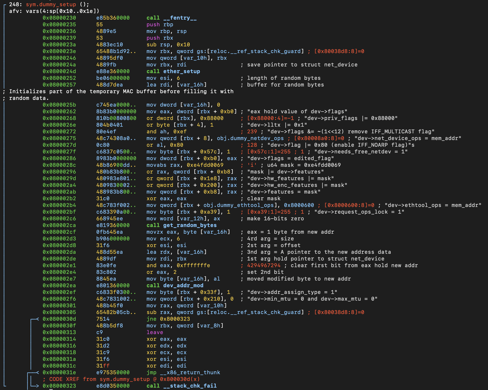

# Function: dummy_setup()

## Overview

**Purpose**

> Initializes a newly allocated struct net_device for the dummy network driver by configuring Ethernet defaults, callbacks, features, and a software-generated MAC address.

---

## Function Summary

| Item | Value |
|------|------|
| Function | dummy_setup |
| Return Type | void |
| Parameters | struct net_device *dev |
| Called From | dummy_init() |
| Calls | ether_setup(), get_random_bytes(), dev_addr_mod() |

---

## High-Level Behavior

1. Initialize the generic Ethernet device.
2. Configure dummy-specific device properties.
3. Configure supported hardware features.
4. Generate and assign a random MAC address.
5. Finish device initialization.

---

## Detailed Analysis

### 1. Ethernet Initialization

**Observation**

- Prepare and invoke the `ether_setup` kernel function.

**Evidence**

```assembly
0x0800024a      4889fb         mov rbx, rdi                ; save pointer to struct net_device
0x0800024d      e88e360000     call ether_setup
```

**Meaning**

- Setup ethernet default.

---

### 2. Configure dummy-specific device properties.

**Observation**

- Writes multiple fields inside struct net_device

**Evidence**

```assembly
0x08000262      8b83b0000000   mov eax, dword [rbx + 0xb0] ; "eax hold value of dev->flags"
0x08000268      810b00800800   or dword [rbx], 0x88000     ; [0x88000:4]=-1 ; "dev->priv_flags |= 0x88000"
0x0800026e      804b0401       or byte [rbx + 4], 1        ; "dev->lltx |= 0x1"
0x08000272      80e4ef         and ah, 0xef                ; 239 ; "dev->flags &= ~(1<<12)"
0x08000275      48c74308a0..   mov qword [rbx + 8], obj.dummy_netdev_ops ; [0x80008a0:8]=0 ; "dev->net_device_ops = mem_addr"
0x0800027d      0c80           or al, 0x80                 ; 128 ; "dev->flag |= 0x80"s
0x0800027f      c6837c0500..   mov byte [rbx + 0x57c], 1   ; [0x57c:1]=255 ; 1 ; "dev->needs_free_netdev = 1"
0x08000286      8983b0000000   mov dword [rbx + 0xb0], eax ; "dev->flags = edited_flag"
0x080002b2      31c0           xor eax, eax                ; clear mask
0x080002b4      48c783f002..   mov qword [rbx + obj.dummy_ethtool_ops], 0x8000600 ; [0x8000600:8]=0 ; "dev->ethtool_ops = mem_addr"
0x080002bf      c683390a00..   mov byte [rbx + 0xa39], 1   ; [0xa39:1]=255 ; 1 ; "dev->request_ops_lock = 1"
```

**Meaning**

The function configures how the dummy device behaves after registration.

Changes include:

- private flags
- normal flags
- callback tables
- cleanup behavior

The function assigns the callback tables used by the networking subsystem to interact with the dummy device.

---

### 3. Configure supported hardware features.

**Observation**

- Writes multiple hardware fields inside struct net_device

**Evidence**

```assembly
0x0800028c      48b86900dd..   movabs rax, 0xe4fdd0069     ; 'i' ; u64 mask = 0xe4fdd0069
0x08000296      480b83b800..   or rax, qword [rbx + 0xb8]  ; "mask |= dev->features"
0x0800029d      480983e801..   or qword [rbx + 0x1e8], rax ; "dev->hw_features |= mask"
0x080002a4      4809830002..   or qword [rbx + 0x200], rax ; "dev->hw_enc_features |= mask"
0x080002ab      488983b800..   mov qword [rbx + 0xb8], rax ; "dev->features = mask"
```

**Meaning**

- The driver builds a capability mask and copies it into the feature-related fields so the networking stack knows which operations the device supports.

---

### 4. Generate and assign a random MAC address.

**Observation**

- The function generates a random 6-byte value and uses it as the device MAC address.
- Before assigning the address, it modifies the first byte to ensure the MAC address is a valid locally administered unicast address.

**Evidence**

```assembly
0x08000252      be06000000     mov esi, 6                  ; length of random bytes
0x08000257      488d7dea       lea rdi, [var_16h]          ; buffer for random bytes
0x0800025b      c745ea0000..   mov dword [var_16h], 0      ; Initializes part of the temporary MAC buffer before filling it with random data.
call get_random_bytes
0x080002cf      0fb645ea       movzx eax, byte [var_16h]   ; eax = 1 byte from new addr
0x080002d3      b906000000     mov ecx, 6                  ; 4rd arg = size
0x080002d8      31f6           xor esi, esi                ; 2st arg = offset
0x080002da      488d55ea       lea rdx, [var_16h]          ; 3nd arg = A pointer to the new address data
0x080002de      4889df         mov rdi, rbx                ; 1st arg hold pointer to struct net_device
0x080002e1      83e0fe         and eax, 0xfffffffe         ; 4294967294 ; clear first bit from eax hold new addr
0x080002e4      83c802         or eax, 2                   ; set 2nd bit
0x080002e7      8845ea         mov byte [var_16h], al      ; moved modified byte to new addr
0x080002ea      e801360000     call dev_addr_mod
```

**Meaning**

- Calls `get_random_bytes()` to generate a random 6-byte address.
- Modifies the first byte of the generated address:
    - Clears bit 0 (I/G bit) to ensure the address is a unicast address.
    - Sets bit 1 (U/L bit) to mark the address as locally administered.
Calls `dev_addr_mod()` to assign the generated MAC address to the network device.

---

### 5. Final Configuration

**Observation**

- Updates additional `struct net_device` fields related to MAC address assignment and MTU configuration.

**Evidence**

```assembly
0x080002ef      c6833f0300..   mov byte [rbx + 0x33f], 1   ; "dev->addr_assign_type = 1"
0x080002f6      48c7831002..   mov qword [rbx + 0x210], 0  ; "dev->min_mtu = 0 and dev->max_mtu = 0"
```

**Meaning**

- Marks the device MAC address as software-assigned because the address was generated using `get_random_bytes()`.
- Initializes MTU-related fields for the dummy network device before it is registered with the networking subsystem.

---

## Important Structures

| Structure | Fields Used |
|-----------|------------|
| struct net_device | flags, priv_flags, lltx, net_device_ops, needs_free_netdev, features, hw_features, hw_enc_features, ethtool_ops, request_ops_lock, addr_assign_type, min_mtu, max_mtu |


---

## Key Observations

- The function does not execute dummy device operations directly. Instead, it initializes callback tables (net_device_ops and ethtool_ops) that will later be used by the networking subsystem.

---

## Notes

**assembly view**
