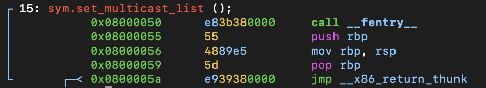

# Function: set_multicast_list()

## Overview

**Purpose**

> Empty multicast configuration callback.

---

## Function Summary

| Item | Value |
|------|------|
| Function | set_multicast_list |
| Return Type | void |
| Parameters | struct net_device *dev |
| Called From | networking subsystem callback |
| Calls | __fentry__ |

---

## High-Level Behavior

1. Function entry tracing.
2. Immediately returns without performing any operation.

---

## Detailed Analysis

### Empty callback

**Observation**

- The function contains no device-specific logic.

**Evidence**

```assembly
0x08000050      call __fentry__
0x08000055      push rbp
0x08000056      mov rbp, rsp
0x08000059      pop rbp
0x0800005a      jmp __x86_return_thunk
```

**Meaning**

- The dummy driver does not need to handle multicast list changes.
- The empty callback satisfies the networking subsystem callback requirement.

## Key Observations

- No state changes.
- No kernel APIs are called.
- No device behavior is modified.

## Notes

**assembly view**
