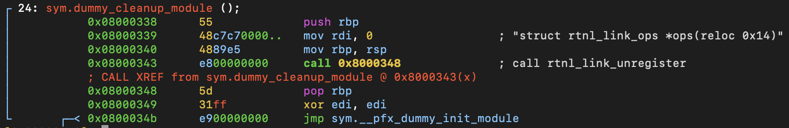

# Function: dummy_cleanup()

## Overview

**Purpose**

> Releases resources and unregisters objects created during module initialization.

---

## Function Summary

| Item | Value |
|------|------|
| Function | dummy_cleanup |
| Return Type | void |
| Parameters | void |
| Called From | N/A |
| Calls | rtnl_link_unregister() |

---

## High-Level Behavior

1. Unregister the dummy network device type from the rtnetlink subsystem.

---

## Detailed Analysis

### 1. Unregister the rtnl network interface.

**Observation**

- prepare and invoke the `rtnl_link_unregister` kernel function.

**Evidence**

```
0x08000339      48c7c70000..   mov rdi, 0                  ; struct rtnl_link_ops *ops(reloc 0x14)
0x08000343      e800000000     call 0x8000348              ; call rtnl_link_unregister
```

**Meaning**

- Calls `rtnl_link_unregister()` to remove the dummy link type registration from the rtnetlink subsystem.
- This reverses the registration performed during module initialization.

---

## Important Structures

| Structure | Fields Used |
|-----------|------------|
| struct rtnl_link_ops | Not visible to static analyse |


---

## Key Observations

- The function only performs cleanup of the rtnetlink registration.
- No additional resources are released directly inside this function.

---

## Notes

- **assembly view**
