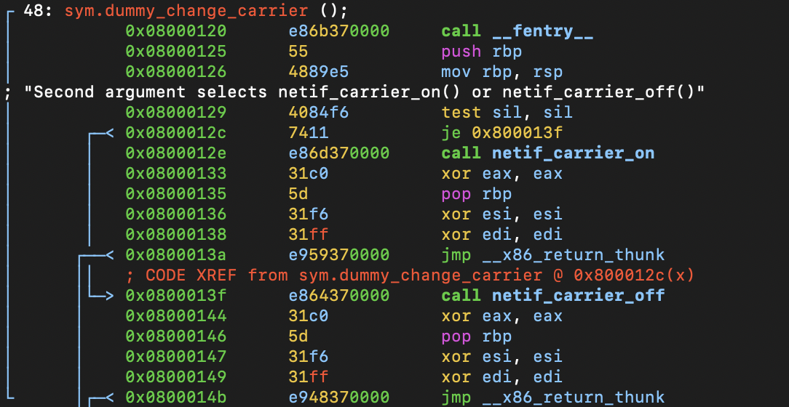

# Function: dummy_change_carrier()

## Overview

**Purpose**

> Updates the network device carrier state based on the second function argument.

---

## Function Summary

| Item | Value |
|------|------|
| Function | dummy_change_carrier |
| Return Type | int |
| Parameters | struct net_device *dev |
| Called From | mostly via callback table |
| Calls | netif_carrier_on(), netif_carrier_off() |

---

## High-Level Behavior

1. Check the second function argument.
2. Enable or disable the network carrier state.
3. Return success.

---

## Detailed Analysis

### 1. Check flag and call related function

**Observation**

- Tests the second function argument as a boolean value.
- Calls either netif_carrier_on() or netif_carrier_off() based on the result.

**Evidence**

```assembly
; "Second argument selects netif_carrier_on() or netif_carrier_off()"
           0x08000129      4084f6         test sil, sil
       ┌─< 0x0800012c      7411           je 0x800013f
       │   0x0800012e      e86d370000     call netif_carrier_on
       │   0x08000133      31c0           xor eax, eax
       │   0x08000135      5d             pop rbp
       │   ; CODE XREF from sym.dummy_change_carrier @ 0x800012c(x)
       └─> 0x0800013f      e864370000     call netif_carrier_off
           0x08000144      31c0           xor eax, eax
           0x08000146      5d             pop rbp
           0x0800014b      e948370000     jmp __x86_return_thunk
```

**Meaning**

- Updates the carrier state of the network device.
- A non-zero second argument enables the carrier, while zero disables it.

---


## Important Structures

| Structure | Fields Used |
|-----------|------------|
| struct net_device | not visible to static analyse |

---

## Key Observations

- The function implements simple branch-based logic with only two execution paths.
- The second function argument determines whether the carrier state is enabled or disabled.
- The function delegates the actual carrier update to existing kernel networking APIs instead of modifying the device directly.
- Returns `0` after updating the carrier state.

---

## Notes

**assembly view**
