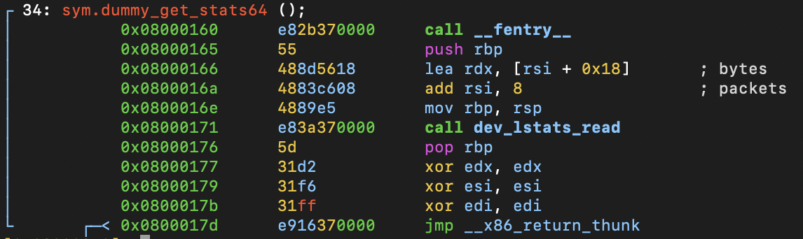

# Function: dummy_get_stats64()

## Overview

**Purpose**

> Retrieves network device statistics by delegating the work to `dev_lstats_read()`.

---

## Function Summary

| Item | Value |
|------|------|
| Function | dummy_get_stats64 |
| Return Type | Likely void (not confirmed by static analysis). |
Parameters | First argument is likely `struct net_device *dev`; the second argument appears to point to a statistics structure.
| Called From | mostly via callback table |
| Calls | dev_lstats_read() |

---

## High-Level Behavior

1. Adjust pointer arguments.
2. Call dev_lstats_read().
3. Return.

---

## Detailed Analysis

### 1. Adjust pointer arguments and call dev_lstats_read().

**Observation**

- Uses pointer arithmetic on the second function argument to prepare two pointers.
- Passes the prepared pointers to `dev_lstats_read()`.

**Evidence**

```assembly
0x08000166      488d5618       lea rdx, [rsi + 0x18]       ; bytes
0x0800016a      4883c608       add rsi, 8                  ; packets
0x0800016e      4889e5         mov rbp, rsp
0x08000171      e83a370000     call dev_lstats_read
```

**Meaning**

- According to the `dev_lstats_read()` prototype, the adjusted pointers correspond to packet and byte statistics.
- The function itself performs no statistics calculations and delegates the work entirely to `dev_lstats_read()`.

---

## Key Observations

- The function acts as a thin wrapper around `dev_lstats_read()`.
- No device-specific processing is performed directly.
- Pointer arithmetic indicates that packet and byte counters are stored within a larger statistics structure.

---

## Notes

**assembly view**
