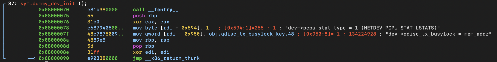

# Function: dummy_dev_init()

## Overview

**Purpose**

> Initializes additional network device fields required by the dummy network driver.

---

## Function Summary

| Item | Value |
|------|------|
| Function | dummy_dev_init |
| Return Type | int |
| Parameters | `struct net_device *dev` |
| Called From | mostly via callback table |
| Calls | None |

---

## High-Level Behavior

1. Configure the per-CPU statistics mode.
2. Initialize the qdisc transmit busy lock class key.
3. Return.

---

## Detailed Analysis

### 1. Configure per-CPU statistics mode.

**Observation**

- Writes the value `1` into the `pcpu_stat_type` field inside `struct net_device`.

**Evidence**

```assembly
0x08000078      c687940500..   mov byte [rdi + 0x594], 1   ; [0x594:1]=255 ; 1 ; "dev->pcpu_stat_type = 1 (NETDEV_PCPU_STAT_LSTATS)"
````

**Structure Verification**

```c
enum netdev_stat_type pcpu_stat_type:8; /* 1428:0 4 */
```

Offset calculation:

```
0x594 = 1428 decimal
```

**Meaning**

* Sets `dev->pcpu_stat_type` to `1`.
* This selects the per-CPU statistics mode used by the network device.

---

### 2. Initialize qdisc transmit busy lock class key.

**Observation**

* Stores the address of `qdisc_tx_busylock_key` into a field inside `struct net_device`.

**Evidence**

```assembly
0x0800007f      48c7875009..   mov qword [rdi + 0x950], obj.qdisc_tx_busylock_key.48 ; [0x950:8]=-1 ; 134224928 ; "dev->qdisc_tx_busylock = mem_addr"
```

**Structure Verification**

```c
struct lock_class_key *qdisc_tx_busylock; /* 2384 8 */
```

Offset calculation:

```
0x950 = 2384 decimal
```

**Meaning**

* Sets:

```c
dev->qdisc_tx_busylock = &qdisc_tx_busylock_key;
```

* `qdisc_tx_busylock_key` is an empty `struct lock_class_key` whose address is used by the kernel lock dependency tracking system to identify a lock class.
* This function initializes lock-related metadata but does not acquire or release any lock.

---

## Key Observations

* The function only initializes fields inside `struct net_device`.
* No external kernel functions are called.
* Structure offsets were verified using `pahole`.
* The `qdisc_tx_busylock_key` relocation identifies the lock class key object assigned to the device.
* No locking operation occurs inside this function.

---

## Verification

Recovered fields were verified using:

* Linux kernel source code
* `pahole` structure layout information
* x86-64 System V calling convention

---

## Notes

**assembly view**



