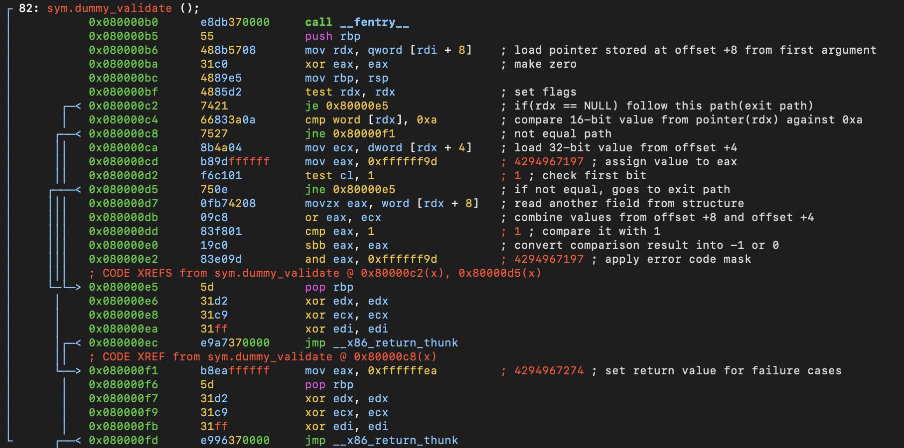

# Function: dummy_validate()

## Overview

**Purpose**

> Validates input data by checking fields inside a referenced structure and returns an error code when validation fails.

---

## Function Summary

| Item | Value |
|------|------|
| Function | dummy_validate |
| Return Type | int |
| Parameters | First argument is a pointer to a structure containing another pointer at offset `+8` |
| Called From | mostly via callback table |
| Calls | None |

---

## High-Level Behavior

1. Retrieve a nested pointer from the first argument.
2. Check whether the pointer is valid.
3. Validate multiple fields from the referenced structure.
4. Return success or an error code based on validation results.

---

## Detailed Analysis

### 1. Retrieve and validate nested pointer

**Observation**

- Reads a pointer from offset `+8` of the first function argument.
- Checks whether the retrieved pointer is NULL.

**Evidence**

```assembly
0x080000b6      488b5708       mov rdx, qword [rdi + 8]
0x080000bf      4885d2         test rdx, rdx
0x080000c2      7421           je 0x80000e5
```

**Meaning**

* Loads a referenced structure pointer.
* If the pointer is NULL, the function follows the exit path.

---

### 2. Validate first field

**Observation**

* Compares a 16-bit value located at the beginning of the referenced structure.

**Evidence**

```assembly
0x080000c4      66833a0a       cmp word [rdx], 0xa
0x080000c8      7527           jne 0x80000f1
```

**Meaning**

* The first 16-bit field must match the value `0xa`.
* If the value does not match, the function returns an error.

---

### 3. Validate flag field

**Observation**

* Reads a 32-bit value from offset `+4` and checks the lowest bit.

**Evidence**

```assembly
0x080000ca      8b4a04         mov ecx, dword [rdx + 4]
0x080000d2      f6c101         test cl, 1
0x080000d5      750e           jne 0x80000e5
```

**Meaning**

* Checks whether bit 0 of the field at offset `+4` is set.
* If the bit is enabled, the function follows the failure path.

---

### 4. Validate combined fields

**Observation**

* Combines values from fields at offsets `+4` and `+8` and compares the result.

**Evidence**

```assembly
0x080000d7      0fb74208       movzx eax, word [rdx + 8]
0x080000db      09c8           or eax, ecx
0x080000dd      83f801         cmp eax, 1
0x080000e0      19c0           sbb eax, eax
0x080000e2      83e09d         and eax, 0xffffff9d
```

**Meaning**

* Combines two structure fields using a bitwise OR operation.
* Converts the comparison result into a return value.
* Applies the final error code mask.

---

### 5. Return error codes

**Observation**

* The function returns different values depending on which validation check fails.

**Evidence**

```assembly
0x080000cd      b89dffffff     mov eax, 0xffffff9d

0x080000f1      b8eaffffff     mov eax, 0xffffffea
```

**Meaning**

* Returns kernel error codes for different invalid input cases.

---

## Important Structures

| Structure                                      | Fields Used                                                    |
| ---------------------------------------------- | -------------------------------------------------------------- |
| Unknown structure referenced by first argument | pointer at offset `+8`, fields at offsets `+0`, `+4`, and `+8` |

---

## Called Functions

| Function | Purpose                      |
| -------- | ---------------------------- |
| None     | No external functions called |

---

## Key Observations

* The function performs validation only and does not modify input data.
* Multiple fields are checked before accepting the input.
* Structure type cannot be confirmed from static analysis alone.
* Offset-based field access suggests validation of a kernel structure passed through a callback interface.

---

## Notes

* Field meanings were not recovered from assembly alone.
* Structure layout can be confirmed later during dynamic analysis.

**assembly view**
