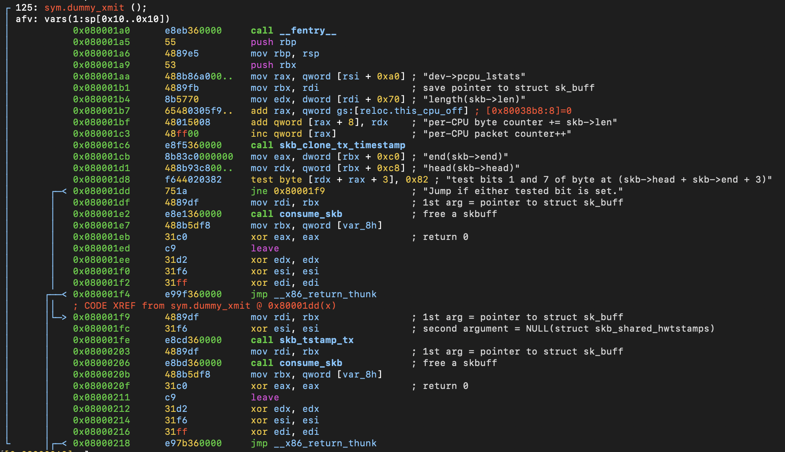

# Function: dummy_xmit()

## Overview

**Purpose**

> Handles packet transmission by updating transmit statistics, processing transmit timestamps, releasing the packet, and returning success.

---

## Function Summary

| Item | Value |
|------|------|
| Function | dummy_xmit |
| Return Type | int |
| Parameters | Likely `struct sk_buff *skb`, `struct net_device *dev` (verified from callback prototype) |
| Called From | Mostly via callback table (`net_device_ops`) |
| Calls | skb_clone_tx_timestamp(), skb_tstamp_tx(), consume_skb() |

---

## High-Level Behavior

1. Update per-CPU transmit statistics.
2. Generate transmit timestamp information.
3. Release the transmitted packet.
4. Return success.

---

## Detailed Analysis

### 1. Update per-CPU transmit statistics

**Observation**

- Reads the transmitted packet length.
- Updates per-CPU packet and byte counters.

**Evidence**

```assembly
0x080001aa      488b86a000..   mov rax, qword [rsi + 0xa0] ; "dev->pcpu_lstats"
0x080001b1      4889fb         mov rbx, rdi                ; save pointer to struct sk_buff
0x080001b4      8b5770         mov edx, dword [rdi + 0x70] ; "length(skb->len)"
0x080001b7      65480305f9..   add rax, qword gs:[reloc.this_cpu_off] ; [0x80038b8:8]=0
0x080001bf      48015008       add qword [rax + 8], rdx    ; "per-CPU byte counter += skb->len"
0x080001c3      48ff00         inc qword [rax]             ; "per-CPU packet counter++"
```

**Meaning**

- Updates per-CPU transmit statistics by increasing the transmitted byte counter using `skb->len` and incrementing the transmitted packet counter.

---

### 2. Process transmit timestamp

**Observation**

- Generates transmit timestamp information.
- Checks packet metadata before optionally recording a software timestamp.

**Evidence**

```assembly
0x080001c6      e8f5360000     call skb_clone_tx_timestamp
0x080001cb      8b83c0000000   mov eax, dword [rbx + 0xc0] ; "end(skb->end)"
0x080001d1      488b93c800..   mov rdx, qword [rbx + 0xc8] ; "head(skb->head)"
0x080001d8      f644020382     test byte [rdx + rax + 3], 0x82 ; "test bits 1 and 7 of byte at (skb->head + skb->end + 3)"
0x080001dd      751a           jne 0x80001f9               ; "Jump if either tested bit is set."
0x080001df      4889df         mov rdi, rbx                ; 1st arg = pointer to struct sk_buff
0x080001e2      e8e1360000     call consume_skb            ; free a skbuff
```

**Meaning**

- Generates transmit timestamp information.
- Depending on packet metadata, records a software transmit timestamp before releasing the packet.

---

### 3. Release transmitted packet

**Observation**

- Releases the transmitted socket buffer in both execution paths.

**Evidence**

```assembly
0x080001e2      e8e1360000     call consume_skb            ; free a skbuff
...
0x08000206      e8bd360000     call consume_skb            ; free a skbuff
```

**Meaning**

- Frees the packet after transmission processing has completed.

---

### 4. Return success

**Observation**

- Returns zero.

**Evidence**

```assembly
0x080001eb      31c0           xor eax, eax                ; return 0
...
0x0800020f      31c0           xor eax, eax                ; return 0
```

**Meaning**

- Reports successful packet transmission.

---

## Important Structures

| Structure | Fields Used |
|-----------|------------|
| struct sk_buff | len, end, head |
| per-CPU statistics structure | packet counter, byte counter |

---

## Called Functions

| Function | Purpose |
|----------|---------|
| skb_clone_tx_timestamp | Clone transmit timestamp information. |
| skb_tstamp_tx | Generate a software transmit timestamp when required. |
| consume_skb | Release the transmitted socket buffer. |

---

## Key Observations

- Updates per-CPU transmit statistics before releasing the packet.
- Handles transmit timestamp processing.
- Always releases the transmitted packet.
- Always returns success (`0`).

---

## Notes

- Packet transmission is simulated; the function does not interact with physical hardware.
- Per-CPU statistics are updated using the current CPU offset (`this_cpu_off`).
- The function is expected to be invoked through the driver's `net_device_ops` transmit callback.

**assembly view**

