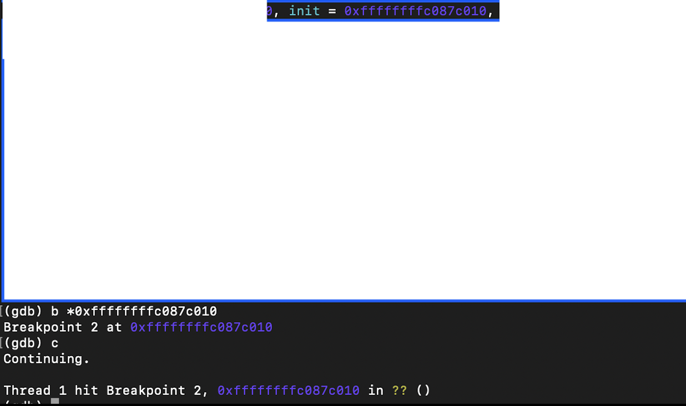
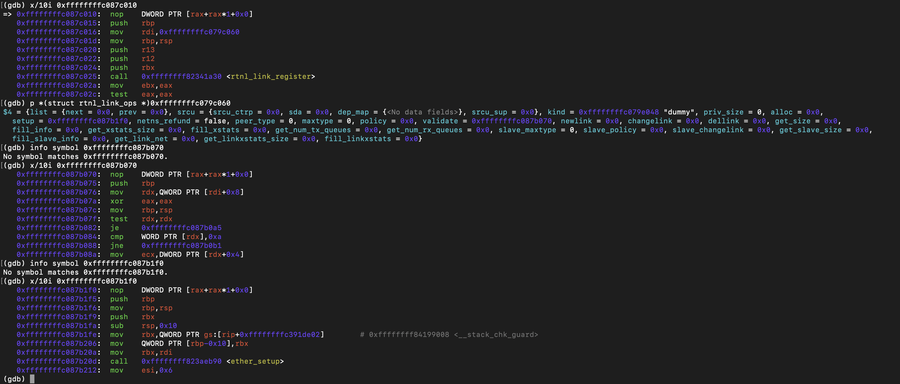
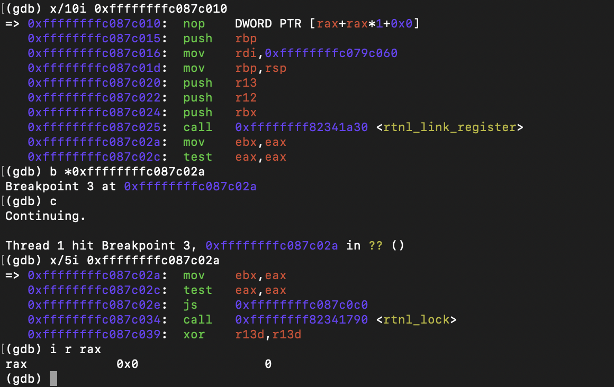
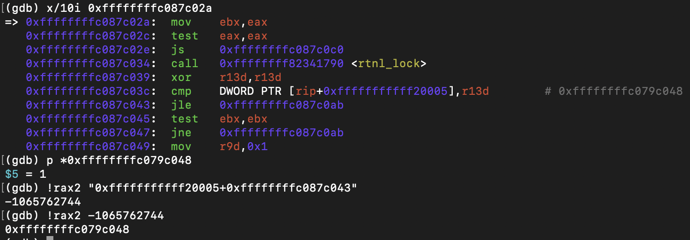
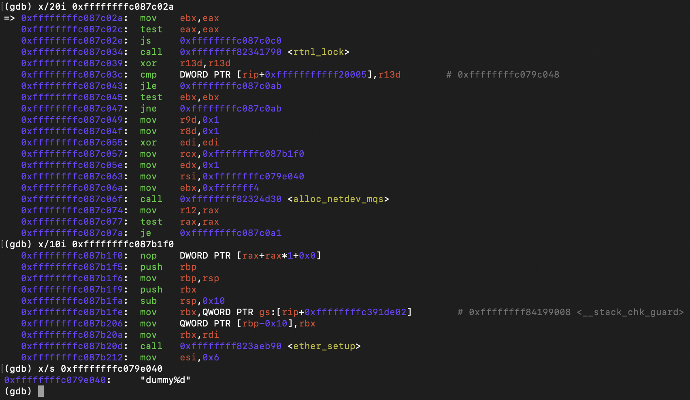
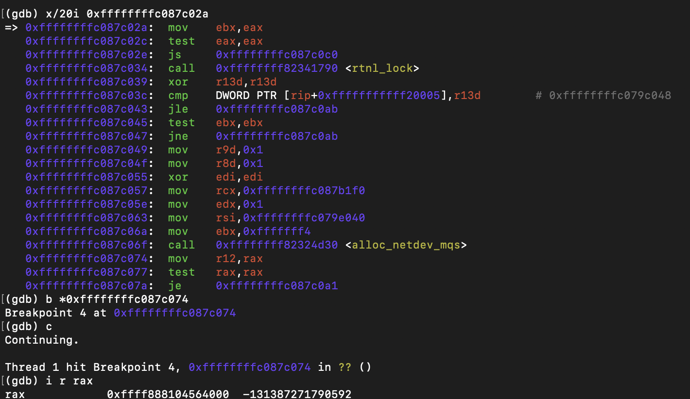
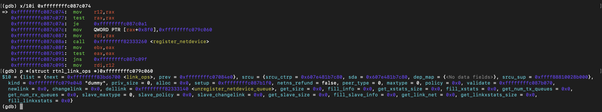
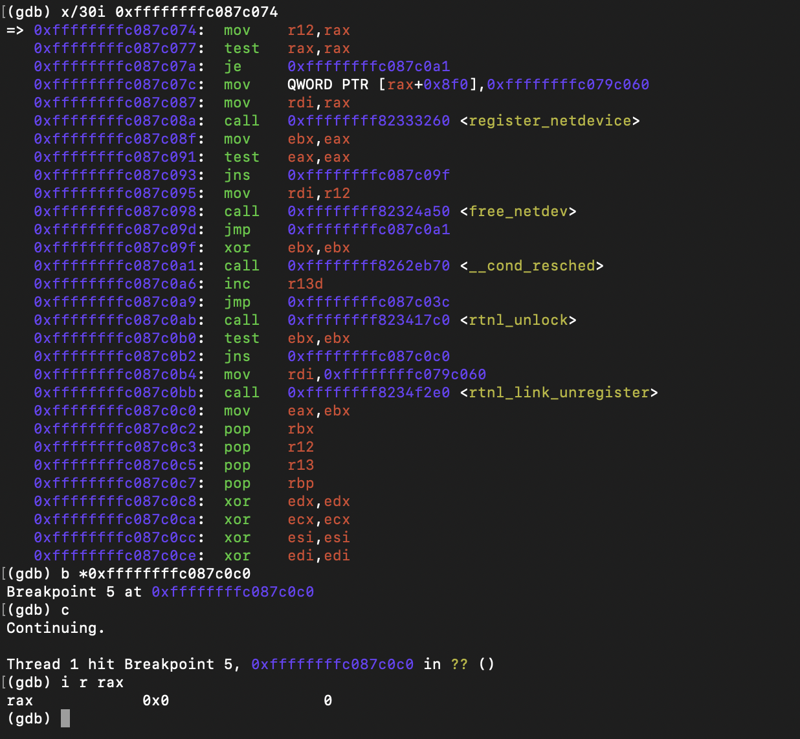

# Module init

## Objective

Observe what happens after `insmod dummy.ko`.

---

## Execution Sequence

```
dummy_init()
 ├── rtnl_link_register()
 ├── rtnl_lock()
 ├── alloc_netdev_mqs()
 ├── register_netdevice()
 ├── __cond_resched()
 └── rtnl_unlock()
```

---

## Runtime Observations

### dummy_init()

Breakpoint reached.



---

### rtnl_link_register

- **Arguments**
    - rtnl_link_ops
        - validate = points to `dummy_validate` function.
        - setup = points to `dummy_setup` function.
        - kind = dummy



- **Return value**
    - it return 0



---

## Iteration limit

This reveal this iterate only 1 time.



---

### alloc_netdev_mqs()

- **important arguments**
    - setup = dummy_setup
    - format_string = "dummy%d"



- **Return value**
    - network device = 0xffff888104564000



---

### register_netdevice()

- **Arguments**
    - rtnl_link_ops
        - validate = points to `dummy_validate` function.
        - setup = points to `dummy_setup` function.
        - kind = dummy



---

### init function return value

- **Return value**
    - return 0;



---

## Environment

| Component | Value |
|---|---|
| Kernel | Linux 6.17.0-19 |
| Architecture | x86_64 |
| Debugger | GDB + QEMU |
| Module | dummy.ko |

---

## Conclusion

Runtime analysis confirmed the static analysis findings:

- dummy_init() registers the dummy rtnetlink operation.
- A single dummy network device is allocated.
- dummy_setup is used as the device initialization callback.
- The device registration succeeds.
- Module initialization completes successfully with return value 0.