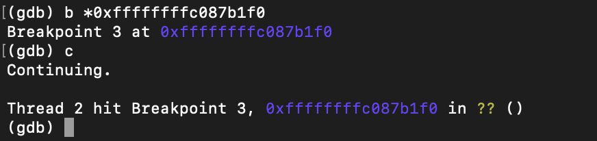
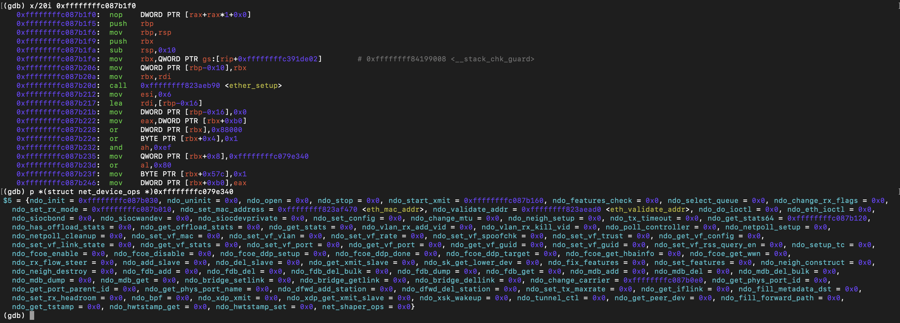
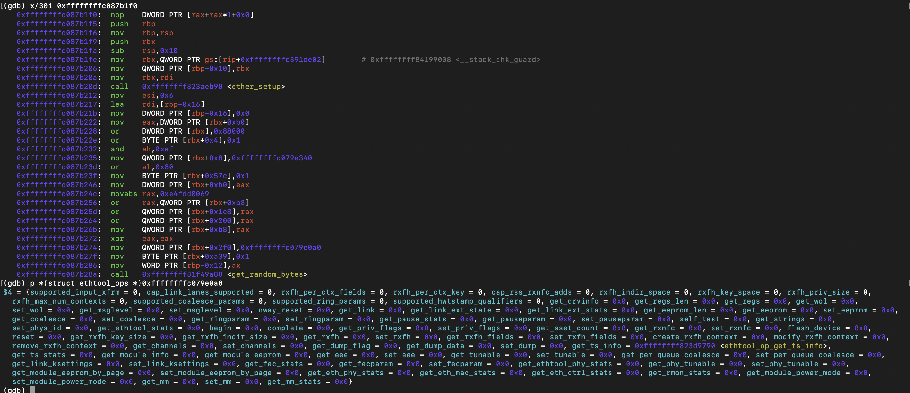

# dummy_setup Runtime Validation

## Objective

Verify that `dummy_setup()` initializes the `net_device_ops` and `ethtool_ops` callback tables correctly.

---

## Execution Sequence

```
dummy_init()
 ├── rtnl_link_register()
 ├── rtnl_lock()
 ├── alloc_netdev_mqs()
 ├── register_netdevice()
 ├── __cond_resched()
 └── rtnl_unlock()

dummy_setup(struct net_device *dev)
 ├── ether_setup()
 ├── get_random_bytes()
 └── dev_addr_mod()
```

---

## Runtime Observations

### dummy_setup()

Breakpoint reached.



---

### net_device_ops

- callbacks
    - ndo_start_xmit        =  dummy_xmit()
    - ndo_set_rx_mode       = 0xffffffffc087b010(Points to an empty function.)
    - ndo_get_stats64       = dummy_get_stats64()
    - ndo_change_carrier    = dummy_change_carrier()

    - ndo_validate_addr     = eth_validate_addr() (kernel)
    - ndo_set_mac_address   = eth_mac_addr() (kernel)



---

### ethtool_ops

- callbacks
    - get_ts_info = ethtool_op_get_ts_info()(kernel)



---

## Environment

| Component | Value |
|---|---|
| Kernel | Linux 6.17.0-19 |
| Architecture | x86_64 |
| Debugger | GDB + QEMU |
| Module | dummy.ko |

---

## Conclusion

Runtime analysis confirmed that `dummy_setup()` correctly initializes both `net_device_ops` and `ethtool_ops`. Driver-specific callbacks point to dummy driver implementations, while generic operations use kernel-provided helpers.