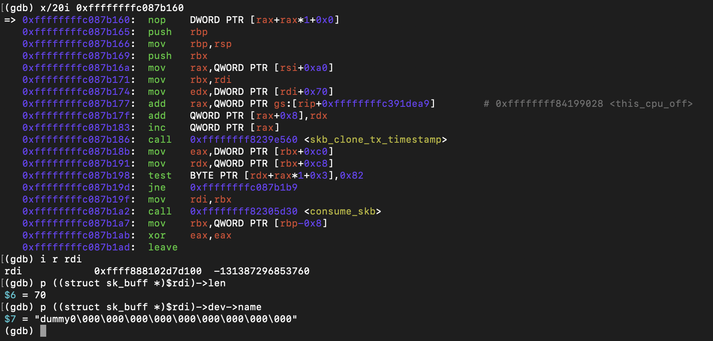
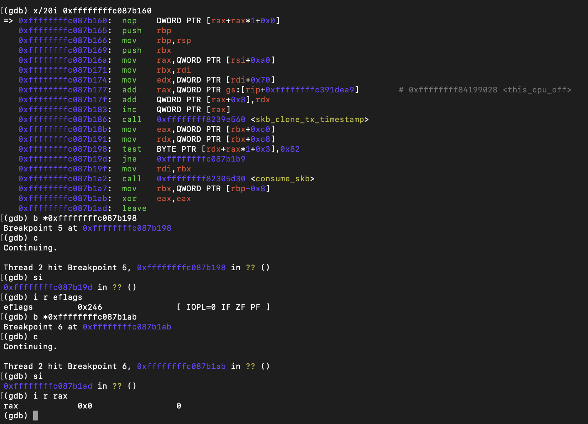

# Packet Transmission

## Objective

Verify that transmitting a packet through `dummy0` invokes `dummy_xmit()`.

---

## Runtime Observations

### dummy_xmit()

Breakpoint reached during packet transmission.

---

### Packet

- skb length = 70 bytes
- network device = dummy0

---

### Return value

- return value = 0 (NETDEV_TX_OK)

---

## Conclusion

Runtime analysis confirmed that transmitting a packet through `dummy0` invokes `dummy_xmit()`. The callback receives the expected `sk_buff` associated with the dummy network device and returns `NETDEV_TX_OK`.