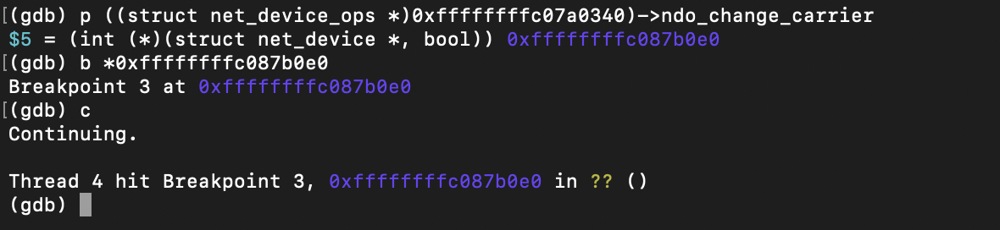
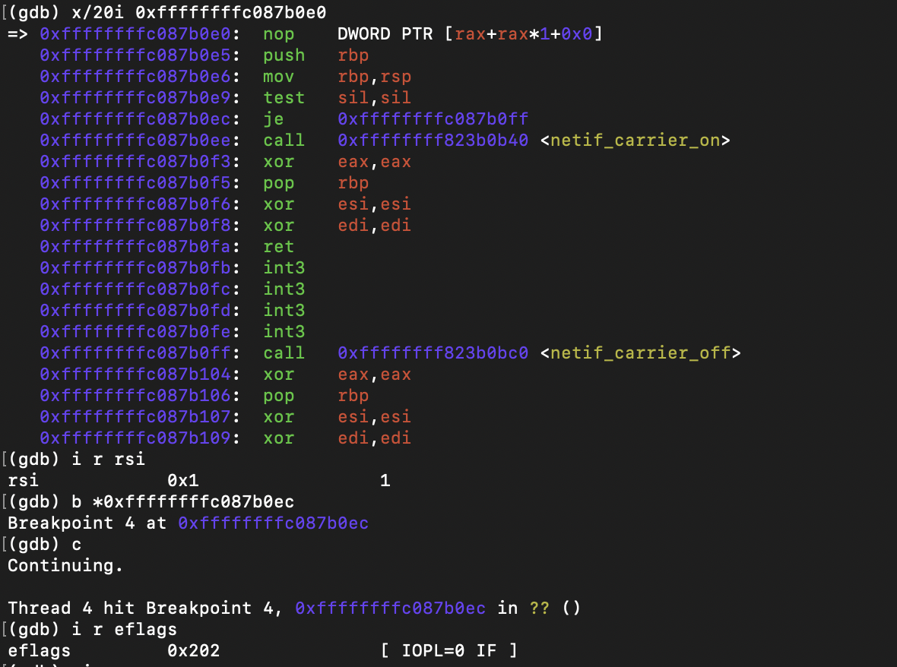
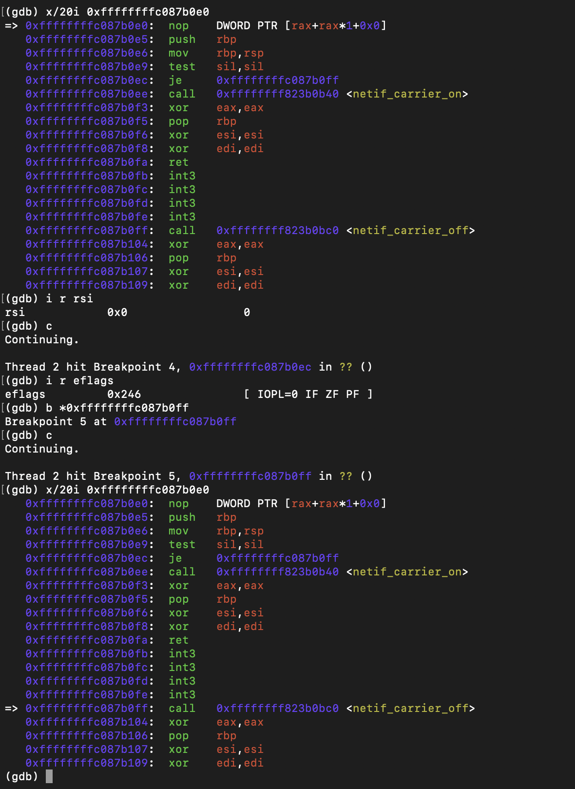

# dummy_change_carrier()

## Trigger

Carrier state was changed using:

```bash
sudo ip link set dev dummy0 carrier on
````

and

```bash
sudo ip link set dev dummy0 carrier off
```

These commands trigger the `ndo_change_carrier` callback registered in `net_device_ops`.

---

## Runtime Observation

Breakpoint reached.



---

### Carrier ON

Command:

```bash
sudo ip link set dev dummy0 carrier on
```

Argument:

* `new_carrier = 1`

Evidence:



Meaning:

The callback enables the carrier state.

---

### Carrier OFF

Command:

```bash
sudo ip link set dev dummy0 carrier off
```

Argument:

* `new_carrier = 0`

Evidence:



Meaning:

The callback disables the carrier state.

---

## Return Value

Both paths return:

```
eax = 0
```

Meaning:

```c
return 0;
```

---

## Conclusion

Runtime analysis confirmed that `dummy_change_carrier()` is invoked when the carrier state is modified through the network interface command. The callback selects `netif_carrier_on()` or `netif_carrier_off()` based on the `new_carrier` argument.
