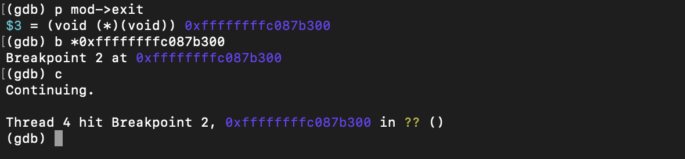
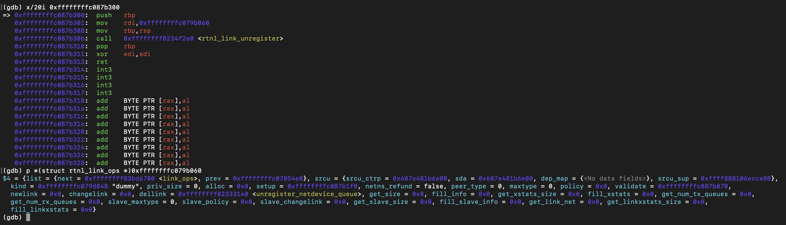

# dummy_cleanup_module()

## Runtime Observation

The module exit callback was reached.



---

### rtnl_link_unregister()

The function passes the registered `rtnl_link_ops` structure:

```
rdi = 0xffffffffc079b060
```

Recovered structure:

* kind = dummy
* setup = dummy_setup
* validate = dummy_validate



---

## Conclusion

Runtime analysis confirmed that unloading the module invokes the exit callback, which unregisters the previously registered `rtnl_link_ops` structure from the RTNETLINK subsystem.