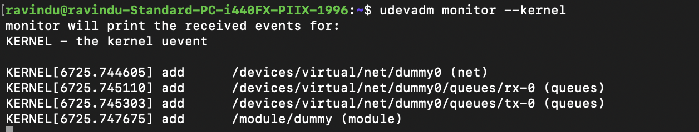
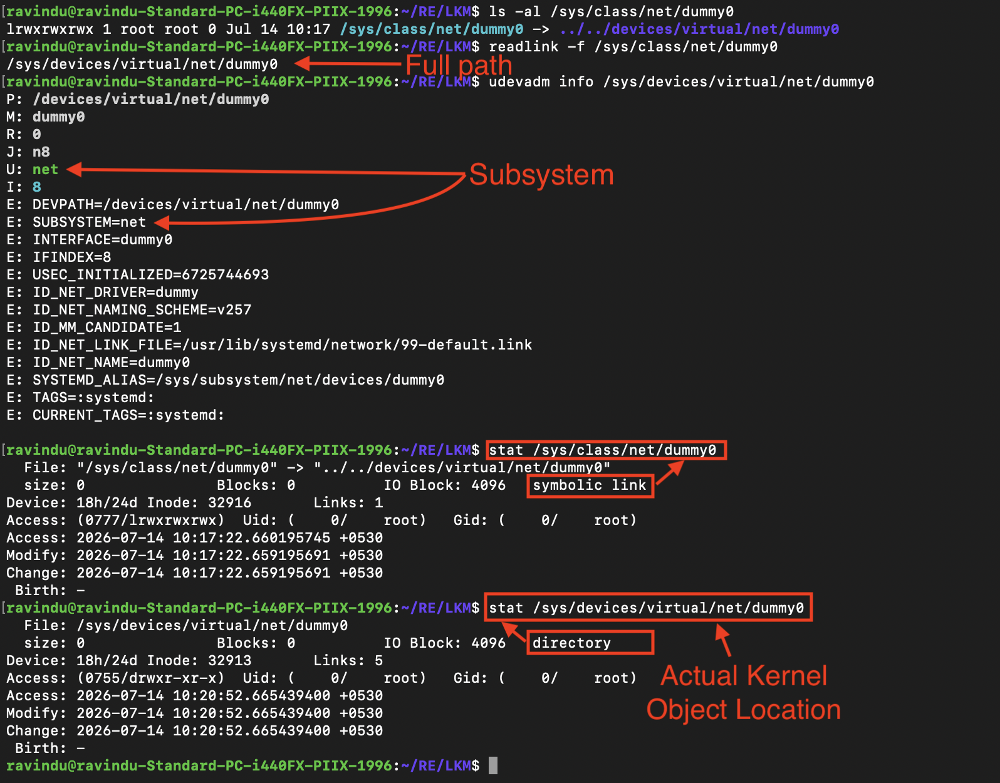
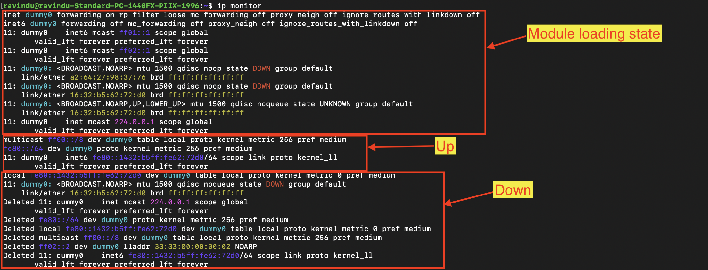
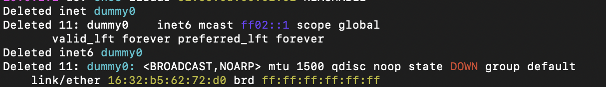

# Behavior Analysis

## Objective

Determine what subsystem this kernel module interacts with without reading source code.

---

## Device Discovery

### udevadm observation

Tool:

```bash
udevadm monitor --kernel
```

Observed:

```
add /devices/virtual/net/dummy0
add /module/dummy
```



Analysis:

The module creates an object registered under the Linux networking subsystem.

---

## Sysfs Analysis

Command:

```bash
udevadm info /sys/devices/virtual/net/dummy0
```

Observed:

```
SUBSYSTEM=net
ID_NET_DRIVER=dummy
INTERFACE=dummy0
```



Analysis:

The module registers a network device.

Object mapping:

```
/sys/class/net/dummy0
        |
        v
/sys/devices/virtual/net/dummy0
```

---

## Network Lifecycle

Tool:

```bash
ip monitor
```

### Creation

Observed:

```
dummy0 created
```

Result:

```
net device appears
sysfs object created
```

---

### Interface activation

Command:

```bash
sudo ip link set dummy0 up
```

Observed:

```
interface state changed to UP
IPv4 multicast state created
IPv6 link-local address assigned
multicast routes added
```

---

### Interface deactivation

Command:

```bash
sudo ip link set dummy0 down
```

Observed:

```
dummy0 state changed to DOWN
IPv6 address state removed
multicast routes removed
interface remains registered
```


---

### Module removal

Command:

```bash
sudo rmmod dummy
```

Observed:

```
network interface removed
dummy0 device disappears
```



---

## Conclusion

From behavioral analysis alone, we identified:

* module subsystem: networking
* created object type: virtual network device
* lifecycle events:

  * registration
  * activation
  * deactivation
  * cleanup
