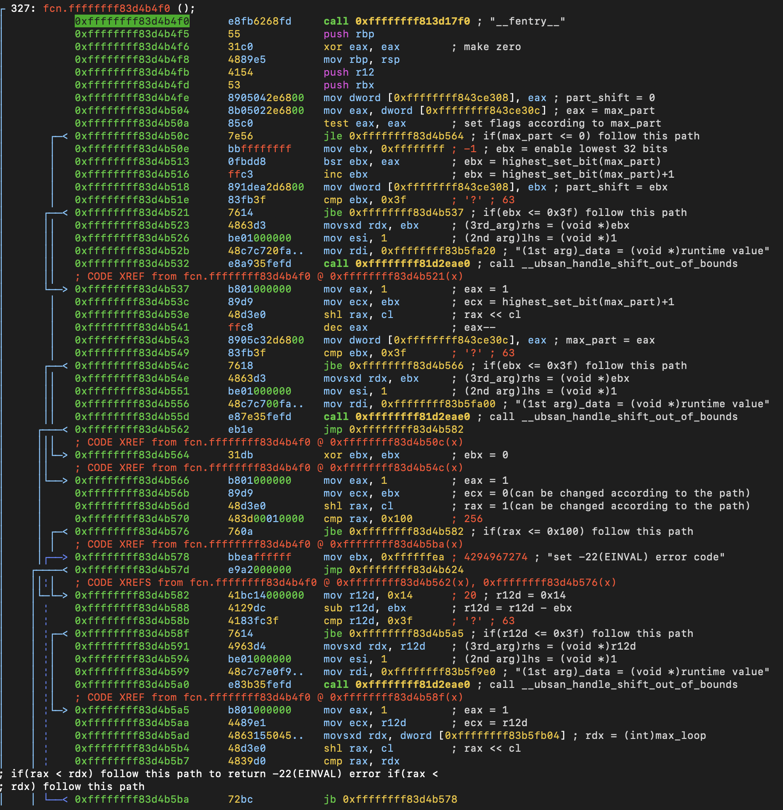
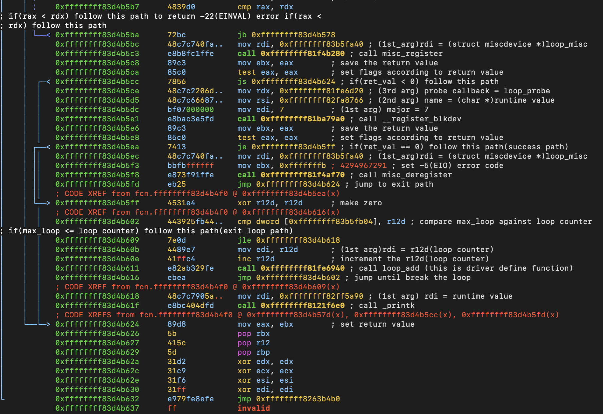

# loop_init

## Purpose

Module initialization function. Performs driver setup and registers required kernel interfaces.

## Recovered call flow

```txt
loop_init()
call __fentry__
call misc_register()
call __register_blkdev()
call misc_deregister()
call loop_add() // driver-defined function
call printk()
```

## Important observations

* Compiler inserted `__ubsan_handle_shift_out_of_bounds` to detect invalid shift operations.
* Calculates `part_shift` using `max_part`.
* Identified error codes: `-22 (EINVAL)` and `-5 (EIO)`.
* Registers a miscellaneous device.
* Registers a block device with the following details:

  * major = 7
  * callback = `loop_probe`
  * name = not visible during static analysis
* If block device registration fails, unregisters the miscellaneous device using `misc_deregister`.
* Contains a loop that repeatedly calls `loop_add()` (driver-defined function).
* Calls `printk()` at the end of the function.

## Assembly view


